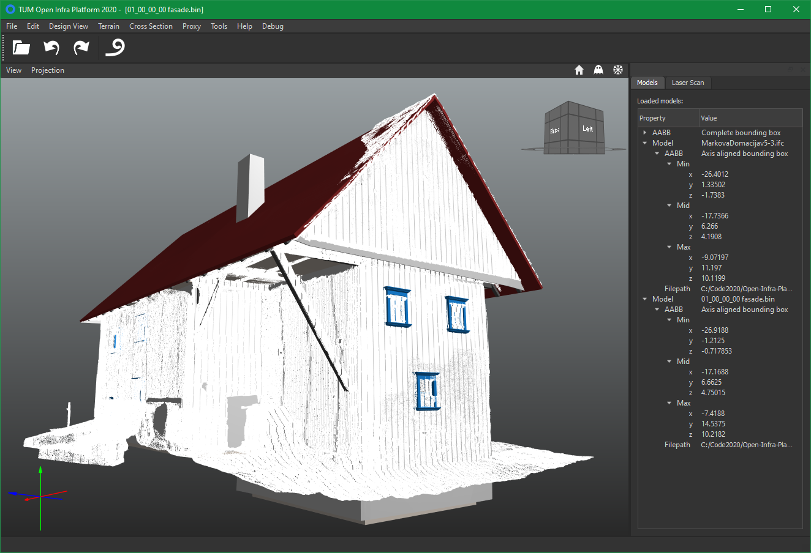

# Summary

The Architecture, Engineering and Construction (AEC) is in its transition from 2D design processes to 3D object-oriented modelling. 
Building Information Modeling (BIM) is steadily gaining importance replacing the conventional Computer-Aided Design (CAD) practices
 and getting implemented in every aspect of the very complex software and stakeholder landscape [@Jaud:2019:iccce].
As one of the main principles, BIM describes the idea of integrating all information
 relevant to the life cycle of a structure, such as a tunnel, bridge, building or road, in a digital (BIM) model.
The digital model is to ensure, among other things [@Amann:2018:Diss]:

- that all relevant data is available to all project participants;
- that all data is in a consistent state (data integrity should be guaranteed);
- that the data can be used efficiently.

*TUM Open Infra Platform* (OIP) is an open source application for
 viewing and analysis of different BIM models used in the civil engineering field.
OIP supports reading, visualization, navigating, and handling of:

- Industry Foundation Classes (IFC) models as specified in ISO 16739 [@iso16739];
- Point Cloud Data (PCD) models as supported by the Cloud Compare library [@CloudCompare].

Multiple models can be loaded at once and compared between each other (see Figure \ref{fig:ifcpcd}).
Their absolute position is accounted for, so the models can be checked against one another for internal differences based on location of elements.

Additionally, OIP incorporates its own EXPRESS parser.
This enables automatic code generation for IFC early-binding library [@Amann:2018:Diss; @Hecht:2019:FBI; @Amann:2018:Programming].
As such, complete contents of IFC files can be interpreted and analysed.
Moreover, type safety is guaranteed at compile time thus reducing the risk for bugs and errors.

Let it be stated here that OIP serves as a prototypical playground for developments.
The software architecture, features, and functionalities have been changed, added or removed as required along the way.
Nowadays, OIP uses the IFC schema and CloudCompare's model as independent internal data models [@Hecht:2019:FBI].
Major elements from previous developments were already realigned, while some (previously available) functionality is still considered as work-in-progress.

# Statement of Need

During the development of the IFC standard, a clear need for an independent software
 capable of consuming and producing IFC files according to the newly developed schemas was determined [@Amann:2015:OIP; @Amann:2015:ICCBEI].
OIP fulfils this role by being open source, using CMake as a build system generator to support various platforms,
 and being based on well known libraries (like Qt, Eigen, Carve and Boost).

Additionally, the EXPRESS parser provided proved useful for automatically producing
 source code and data models from newly developed schemas as needed [@vilgertshofer:2017:iwcce; @Amann:2018:Diss].

With the emergence of Scan2BIM and ScanVsBIM research field (deriving from or merely comparing PCD and BIM models),
 a tool that supports both PCD and IFC data is a welcomed addition to the research processes.
Recently, OIP was selected among many other software solutions as best suitable for the development of a Scan+BIM platform [@Valero:2020:ISARC].

# Research Projects

The origins of the software date back to the first projects expanding IFC for infrastructure
 at the Technical University of Munich [@Amann:2014:ECPPM; @Singer:2014:IfcAlignment; @Amann:2015:OIP; @Amann:2015:OKSTRA; @Amann:2015:ICCBEI].
There, first implementations of roads' geometric concepts
 and interfacing between multiple standards (like IFC, OKSTRA and LandXML) have been explored (see Figure \ref{fig:road}).

Further on, many functionalities were added during the course of these projects:

- support for first experimental IFC schema additions for tunnels [@vilgertshofer:2017:iwcce];
- support for PCD and their analysis [@Hecht:2018:PCDtoAlignment];
- support for IFC Programming Language (IFC-PL) [@Amann:2018:Diss];
- support for linked data approaches [@Beetz:2019:linkeddata];
- support for IFC4x1, IFC4x2, and IFC4x3 candidate versions of the IFC standard during their development [@Jaud:2020:siBIM].

# Acknowledgements

The development of the software has been supported through many projects founded by:

- buildingSMART International Ltd.;
- Federal Ministry for Transport and Digital Infrastructure, Germany (Bundesministerium für Verkehr und digitale Infrastruktur);
- Federal Highway Research Institute, Germany (Bundesanstalt für Straßenwesen);
- German research Foundation, Germany (Deutsche Forschungsgesellschaft);
- Leonhard Obermeyer Center, Germany;
- Technical University of Munich, Germany.

We gratefully acknowledge their support.

# References

