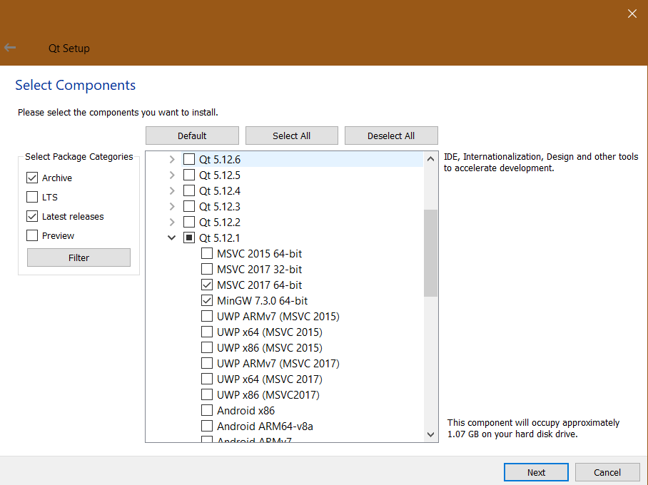

# OpenInfraPlatform Installation 

***

This short guide shows you how to compile the project TUM Open Infra Platform.
**Warning:** This document is only snapshot of the current state and may be become obsolete in the future.

***

## Content 

1. [Prereguisites](#Prerequisites)
2. [Setup](#Setup) 
	* [Download source code](#Source_code)
	* [Preparing solution](#Prep_solution) 
3. [Building the OpenInfraPlatform in Visual Studio](#Building_OIP) 
	* [Generating IFC early binding](#generating_EarlyBinding)
	* [Compiling user interface](#Compiling_interface)
4. [Generating documentation](#Generating_Doc)
	* [Get Dot and Doxygen](#Get_Dot)

##  Prerequisites 

Before you can proceed to the Installation of **OpenInfraPlatform**, check, if these steps are completed:

1. **Visual Studio 2017** is installed to your computer - find [here](https://my.visualstudio.com/Downloads?q=visual%20studio%202017&wt.mc_id=o~msft~vscom~older-downloads)
2. **CMake 3.17.0** is installed - find [here](https://cmake.org/download/)
3. **Qt 5.12.1** is installed and included in the path (environment variable)-  find [here](https://www.qt.io/download-open-source)

	*	Download Qt Online Installer 
	*	In the meantime, your computer is downloading Qt installer, create Qt account. 
	*	Sign in with your new account to Qt installer and select directory, where Qt will be installed. (** C:\Qt ** should be default option, if not write **this** path out)
	*	Select components, you want to install:

		* Check the *Archive* box
		* Select *Filter*
		* Open section **Qt 5.12.1**
		* **Mandatory:** Select *binaries x64 msvc2017*
		* **Mandatory:** Select *mingw*
		
		

		* **HINT:** There are components, which Qt Online Installer selects as default options. You can uncheck these components for saving computer memory.

4. **Boost 1_65_1** is installed (find [here](https://sourceforge.net/projects/boost/files/boost-binaries/1.65.1/boost_1_65_1-msvc-14.1-64.exe/download)).

	* Create a folder named thirdparty in `C:\` and install **Boost 1_65_1** to `C:\thirdparty\vs2015\x64\boost_1_65_1`.
	* Add this path into the environment variables. (Create new environment variable called `Boost_INCLUDE_DIR`. This variable should point to the binary folder, where **Boost 1_65_1** is staged (e.g. `C:\thirdparty\vs2015\x64\boost_1_65_1`).

5. **Anaconda 2** (version with Python 2.7)  - find [here](https://repo.anaconda.com/archive/Anaconda2-2019.10-Windows-x86_64.exe) (For Windows users) 

***
##  Setup

###  Download source code 

 Clone **OpenInfraPlatform** repository  - more information you can find [here](./GitProcess.md)

###  Preparing solution 

1. Open CMake.
2. In the line **Where is the source code:** copy the path to your source folder (e.g. C:\dev\Open-Infra-Platform).
3. In the line **Where to build the binaries:**  copy the path to the binaries folder (e.g. C:\dev\project_OIP). **NOTE:** The source folder as well as *Program Files* and *Windows* folders are **invalid** locations for the binary folder.
4. Check the *Grouped* and *Advanced* boxes (top right in CMake GUI)..
5. Click *Configure*. 
6. Select the Generator:
	* Select "Visual Studio 15 2017 Win64".
	* Select "x64"
	* Write "host=x64".

7. For detailed descriptions of all configuration options that can be selected in the CMake GUI, see [here](./CMakeOptions.md) 

	**HINT:** A few (red) warnings in the lower window of CMake can be ignored as long as it writes 'Configuring done' at the end

8. After configuration process has successfully finished, click *Generate*.
9. After generation process is done click *open Project*. It will open OpenInfraPlatform solution in the Visual Studio.
***
##  Building the OpenInfraPlatform in Visual Studio 

###  Generating IFC early binding

**NOTE:** If you are using Open-Infra-Platform only with point clouds, you can skip these steps.

1. In the *project browser* open **OpenInfraPlatform** project folder. Find folder **Commands**. In the folder **Commands** *build*  **OpenInfraPlatform.Commands.UpdateBoostMpl**.

	**NOTE:** This must be done only for the first time. 

2. After first project is successfully built find the folder **ExpressBindingGenerator**. *Build* project **OpenInfraPlatform.ExpressBindingGenerator**.

	**HINT:** You can expect that one item will be skipped. This item will be *built* afterwards. 

3. In the folder **ExpressBindingGenerator** find the folder **Commands**. There you should *build* project **Commands.GenerateEarlyBinding.IFC?**. 

	**NOTE:** By the default this will build **Commands.GenerateEarlyBinding.IFC4X3**. If you change a shema to other, you would have to *generate* CMake again.

4. **Important**: Open CMake and select *Generate* to include newly generated IFC early binding code in the solution.

###  Compiling user interface

**NOTE:** Build dependencies are set, so building only the last step should automatically build all.

1. Open Visual Studio and find the folder **EarlyBinding**. *Build* project **OpenInfraPlatform.IFC?**.
2. If you are using point clouds *build* project **OpenInfraPlatform.PointCloudProcessing**.
3. *Build* project **OpenInfraPlatform.Core**.
4. *Build* project **OpenInfraPlatform.UI**.
5. *Build* all projects staged in the **Copy** project folder. 

	**NOTE:** execute **Get_OKLABI.cmd** in the source folder (e.g. C:\dev\Open-Infra-Platform\external\) to prevent an error during the build process. After the execution of **Get_OKLABI.cmd**, it's necessary to *configure* and *generate* OpenInfraPlatform project once again in CMake.

##  Generating documentation

###  Get Dot and Doxygen

1. After cloning **OpenInfraPlatform** repository open OpenInfraPlatform source folder. 
2. Open folder **external**
3. Open files:
	* GetDot.cmd  
	* GetDoxygen.cmd